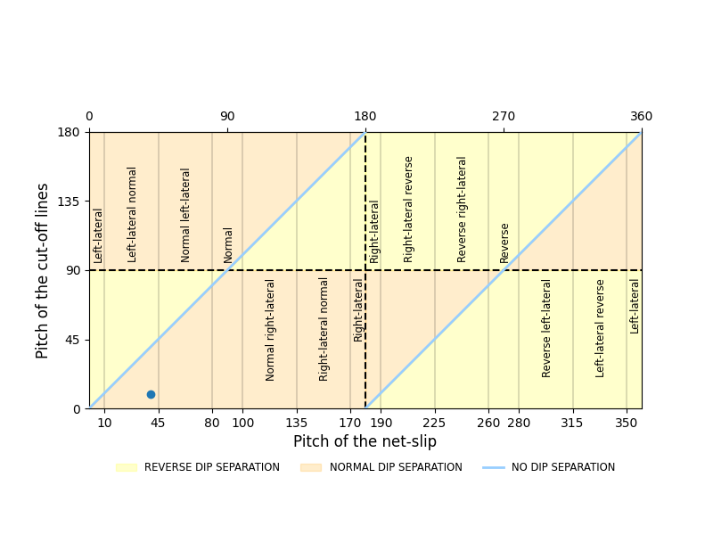

# Fault Slip and Separation Explorer (fse)

This project implements a Python script designed to explore the relationships between slip and separation in faults that displace pre-existing inclined layers. The tool generates a cross section and a map, and plots the fault plane as in Ragan (2009). Additionally, it plots field-collected data, as presented in:

*Magan, M., Poblet, J., & Bulnes, M. (2022). Tools to analyse misleading kinematic interpretations of faults offsetting inclined or folded surfaces: Applications to Asturian Basin (NW Iberian Peninsula) examples. Journal of Structural Geology, 162, 104687.*

## Features
- Plots the data on the graphs proposed in the paper.
- Plots the fault plane as in Ragan (2009).
- Plots a cross section and a map.

## Functionality and Results

### Functionality

1. **Data Input**: The script takes input data from field measurements. This includes orientation of fault and bedding planes and pitch of the net-slip.
2. **Processing**: The script processes these data to construct the 3D geometry of the fault and bedding planes. It then applies the net-slip vector to simulate the displacement.


3. **Visualization**: The script generates visualizations, including:
   - **Map View**: Shows the horizontal intersection of the fault and bedding planes.
   - **Cross-Section View**: Displays the vertical intersection in the dip direction of the fault.
   - **Fault plane view as in Ragan (2009).**
   - **Plots proposed in the paper.**

### Input 
The program will ask the following parameters:
```console
Enter Fault dip (0-90):
Enter Fault dip direction (0-360):
Enter Bedding dip (0-90):
Enter Bedding dip direction (0-360):
Enter Pitch net slip (0-360):
Enter Units net slip (10 by default):
```
Then it will show the menu:
```console
1. Plot fault plane as in Ragan (2009)
2. Dip separation plot
3. Strike separation plot
4. Section and Map
5. Exit
Select option:
```
### Results
The resulting visualizations provide insights into the relationship between slip and separation in faults. 

Examples of output visualizations with following data input:

   - **Fault dip**: 50
   - **Fault dip direction**: 156
   - **Bedding dip**: 10
   - **Bedding dip direction**: 28
   - **Pitch net slip**: 40
   - **Units net slip**: 10

Figure 1: View of a fault plane as in Ragan (2009).


Figure 2: Dip separation plot.


Figure 3: Strike separation plot.


Figure 4: Section and Map.


## Possible Issues

- **Division by Zero**: Ensure that your input data do not cause any division by zero. This can occur if certain angles or values are not handled correctly. 

- **Visualization issues**: If the combination of your input data and the net-slip value causes the generated diagrams (map and cross section) to be out of the coordinate system bounds, you may need to adjust your inputs. 

## Installation

Installation required libraries

```
pip install pandas mplstereonet
```

## Usage

From Python command prompt:

```
python -m main
```

## Citation

`Magan, M., Poblet, J., & Bulnes, M. (2022). Tools to analyse misleading kinematic interpretations of faults offsetting inclined or folded surfaces: Applications to Asturian Basin (NW Iberian Peninsula) examples. Journal of Structural Geology, 162, 104687.`

```
@article{magan2022tools,
  title={Tools to analyse misleading kinematic interpretations of faults offsetting inclined or folded surfaces: Applications to Asturian Basin (NW Iberian Peninsula) examples},
  author={Magan, Marta and Poblet, Josep and Bulnes, Mayte},
  journal={Journal of Structural Geology},
  volume={162},
  pages={104687},
  year={2022},
  publisher={Elsevier}
}
```
## References
`Ragan, D. M. (2009). Structural Geology: An Introduction to Geometrical Techniques. Cambridge University Press, 602 p.`
